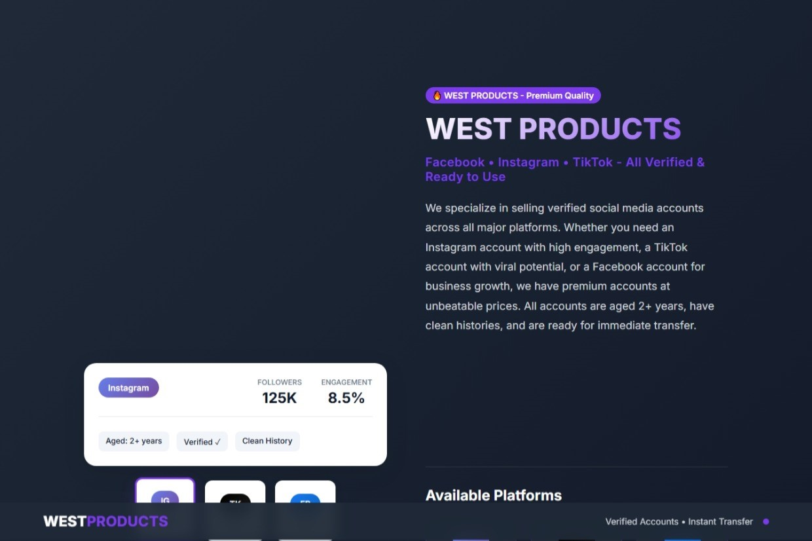

West Products Website

A modern, responsive landing page built for West Products, a digital services business that specializes in selling social media accounts and related online services. This project was created to showcase my frontend development skills, with a focus on clean UI, responsive design, and user-friendly layouts.

🚀 Live Demo

https://west-products.netlify.app/

📸 Preview

✨ Features

Responsive design for mobile, tablet, and desktop

Modern and clean user interface

Smooth scrolling navigation

Product showcase section

About section

Contact section

Optimized layout and spacing

🛠️ Built With

HTML5

CSS3

JavaScript

🎯 Purpose

This project was developed as a portfolio piece to demonstrate my ability to build responsive and visually appealing business landing pages.

📂 Installation

Clone the repository:

git clone https://github.com/Kwestuche-cell/west-products-landing-page.git

Navigate into the project folder:

cd west-products-landing-page

Open index.html in your browser, or run the project using a local development server.

📈 Future Improvements

Add product filtering

Implement a shopping cart

Improve accessibility

Add animations for enhanced user experience

Integrate a backend for product management

👨‍💻 Author

Kwest Uche

Frontend Developer passionate about creating modern, responsive, and user-friendly web experiences.

Feel free to connect with me and explore my other projects!
